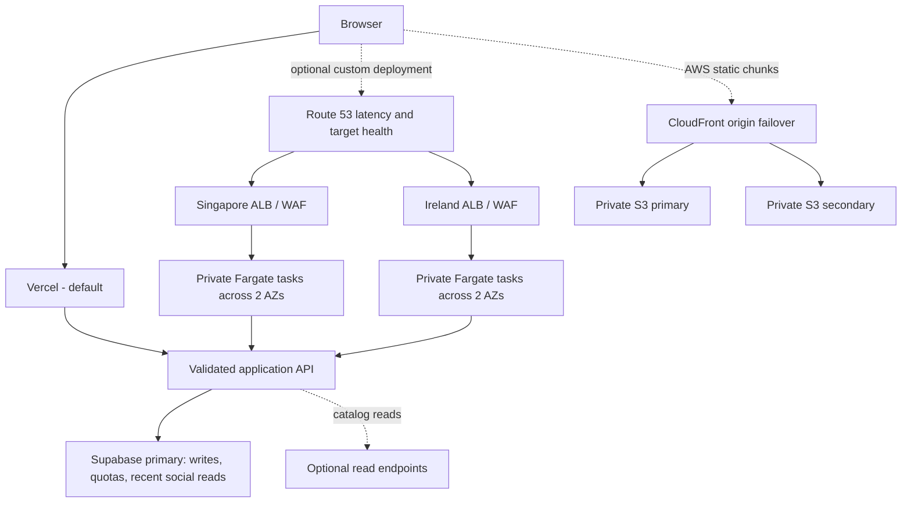

# Application review and scaling design

Vercel + Supabase is the default. AWS is an explicitly selected custom deployment; both use the same application and database contract.

## Review findings addressed

| Finding | Implemented change |
| --- | --- |
| Public unrestricted database writes and localStorage identity spoofing | Server-only mutation APIs, HMAC-signed HTTP-only guest cookie, restricted database grants/policies |
| Process-local limits would reset per task/region | Atomic PostgreSQL quota buckets shared by IP and guest; fail closed on errors |
| Score zero rejected, unchecked scores/inputs, unbounded pagination | Strict Zod schemas, bounded body reader, numeric ranges, query limits and search sanitization |
| Rating edits/deletes and concurrent aggregates were incorrect | Row-locked incremental aggregates and trigger handling for insert/update/delete |
| Play count and analytics were separate unreliable writes | Analytics insert and play counter change occur in one database transaction |
| Database outages appeared as empty catalogs or missing games | Errors propagate to a retryable boundary; real missing slugs return 404; health separates liveness/readiness |
| Search downloaded only the first 100 games | Debounced server-side search; stale request cancellation; distinct error state |
| Categories operated on a truncated in-memory catalog | Server-filtered pagination and load-more behavior |
| Favorites/recent history could fail on bad local storage | Validated storage reads and subscription-driven UI updates |
| Lint failures and relaxed typing | Strict TypeScript, typed database relationships/functions, typed Phaser boundaries, corrected React hooks |
| Wildcard image optimization and missing response protection | Exact image-host allowlist, security headers, no X-Powered-By |
| No reliable release gate or rollback verification | CI, SQL/security/browser/release regression tests; staged Vercel promotion; optional sequential AWS releases |
| Regional build/cache/version inconsistency | One AWS artifact for every region, deployment ID, retained shared immutable chunks, dynamic uncached database pages |

## Deliberate boundaries

Database-backed HTML and APIs are dynamic with uncached database reads. There is no independent filesystem ISR state to invalidate across AWS tasks. This prioritizes correctness and simple failover. Measure query volume before adding a shared Redis/cache handler and tag coordination; do not turn on per-container ISR and assume global consistency. Static game bundles and framework chunks remain cacheable.

Read replicas are optional and asynchronous. Only catalog reads may use them; post-write social reads use the primary. A slow/unavailable configured read endpoint makes regional readiness fail. None of the AWS infrastructure implements Supabase database promotion or replication provisioning. The shared primary remains the write-availability boundary.

Guest cookies protect ownership against casual ID spoofing, but clearing cookies creates a new guest. Rate limits and WAF reduce abuse without proving a human identity. Game scores originate in the browser and can be fabricated. Introduce authenticated accounts, moderation and server-verified game sessions before rewards or competitive stakes.

Search uses bounded substring matching and stable ordering by play count plus ID. Offset pagination can shift if play counts change while browsing; the client deduplicates appended games. At a large catalog size, move to indexed search and keyset pagination. Comments/ratings reads show the most recent 50 rows; leaderboard reads are capped at 100.

AWS infrastructure is designed for two regions initially. A third region requires another provider alias/module, CIDR, regional certificate and explicit release stage. Route 53 chooses via DNS resolver location/latency and cached responses; it does not guarantee instant or per-user regional switching. Static origin failover is independent of app-region DNS routing.

The infrastructure has been prepared and locally validated, not cloud-applied. Region failover, IAM permissions in your account, DNS/certificate issuance, provider quotas, notification delivery, live Vercel promotion and actual Supabase restore behavior require environment-specific acceptance checks later.
